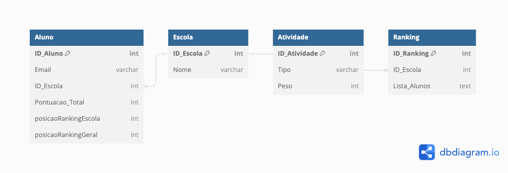

# Projeto DNC School Ranking

## 📖 Introdução

Este projeto foi desenvolvido como parte de um teste para uma vaga de Engenheiro de Software PL na escola DNC. O objetivo principal do sistema é gerenciar e exibir um ranking de alunos baseado nas notas que recebem em diferentes atividades, sendo estas divididas em Tarefas, Desafios e Projetos. Cada escola (Dados, Tecnologia e Produto) terá seu próprio ranking e haverá um pódio que exibe os três primeiros colocados gerais, sem separação de escola.

## 🌟 Funcionalidades

1. **Registro de Notas**: Rotas para registrar as notas obtidas por cada aluno e calcular a pontuação no ranking de acordo com a categoria da atividade.
2. **Rankings de Escolas**: Rankings separados para as escolas de Dados, Tecnologia e Produto.
3. **Pódio Geral**: Uma seção especial que exibe os três principais alunos de todas as escolas combinadas.
4. **Atualização em Tempo Real**: Ainda não implementado

## MER (Modelo Entidade Relacionamento)

## 🛠️ Tecnologias Utilizadas

- Backend: Node.js, Express, Mongoose, TypeScript, Socket.io
- Frontend: React, TypeScript, Vite, Material Ui
- Banco de Dados: MongoDB
- Outras Tecnologias: Docker

## 🏃 Instruções para Execução

### Backend

1. Clone o repositório para sua máquina local.
2. Navegue até o diretório do backend.
3. Execute o comando `npm i`.
4. Execute o comando `npm run dev`.

### Frontend

1. Navegue até o diretório do frontend.
2. Execute o comando `npm i`.
3. Execute o comando `npm run dev`.

